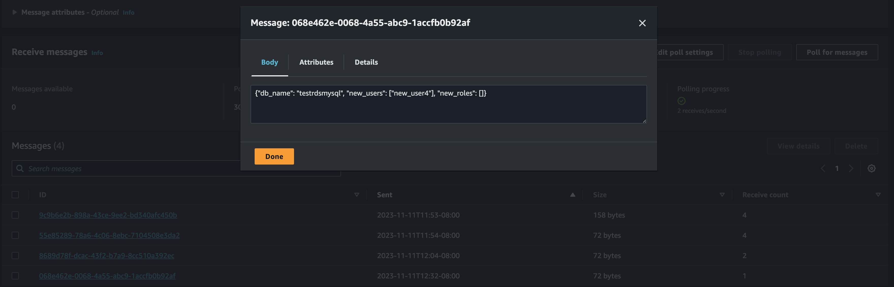

# Test Conducted

1. Create all test resources via [the terraform script](../terraform_infra/infra.tf)  
    - 1 RDS MySQL instance as target db to be scannd,  
    - 2 dynamodb tables:
        - A: store a list of db (which has the 1 RDS db) and  
        - B: the users and roles retrieved from the RDS  
    - 1 sqs queue and lambda  
2. Create new users in the rds db via [createnewuser.py](./createnewuser.py)  
3. Run [main lambd function db_user_scanner()](../source_lambda/db_user_scanner_lambda.py), which is expected to
    - add new user to the 2nd dynamodb table created above  
    - send the new user info to a SQS queue for others to consume  
4. Observe SQS queue and saw new queue coming in with the newly added user in the RDS 